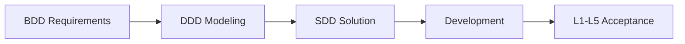

# Agileflow — AI Agent Skill · Ship in ~1 Hour 

**English** | [中文](README.zh-CN.md)

> Turn ideas into **runnable, testable, handoff-ready** software with a five-stage agile pipeline and **BDD→DDD→SDD→TDD**. Simple projects ship in **~1 hour**; MVPs in **half a day**.

[](skills/agileflow/SKILL.md)
[](#why-ship-in-1-hour)

---

## One-liner

**Agileflow** encodes software engineering best practices into an AI-executable Skill: **BDD** for requirements, **DDD** for modeling, **SDD** for design, **TDD** for code — with human confirmation gates at every stage and a full `atlas/` documentation trail.  
Tell your AI *"run agileflow"* — from zero to deployable in **as little as 1 hour**, usually an MVP within half a day.

> **Fast mode ≠ skip stages.** Fast still walks req→mod→sol→dev→tests; it only merges AskQuestions and thins docs by **risk tier** (lite/standard/full).

---

## Why ship in ~1 hour?

Typical AI coding: **code first, think later** → missing tests, missing docs, requirements change and everything gets thrown away. Delivery measured in **days**.

Agileflow: **compress the pipeline without dropping structure**.

| Step | Traditional | Agileflow (Fast Mode) | Typical Time |
|------|-------------|----------------------|--------------|
| Requirements | Verbal, AI guesses | BDD scenarios + 1 round of confirmation | **5–10 min** |
| Modeling | Skipped or patched later | Lightweight DDD: core tables + DDL | **5–10 min** |
| Design | Written while coding | SDD template: API + task list | **10–15 min** |
| Development | Large dumps, hard to maintain | Atomic tasks, one at a time | **20–30 min** |
| Acceptance | Manual click-through | L1+L3 automated | **5–10 min** |
| **Total** | 1–3 days + rework | **~1 hour** (simple CRUD / tools) | |

> **Faster** (only when **AF not enabled**): hotfix, tiny edits → skip full pipeline, **L1+L3 in minutes**.  
> **AF enabled**: any code write requires `--gate write-code` green; no micro/hotfix shortcut.

---

## Who is this for?

| Audience | Pain Point | How Agileflow Helps |
|----------|------------|---------------------|
| **Indie devs / founders** | Ideas sit for weeks before a demo | Fast mode: **deployable demo in ~1 hour** |
| **Freelancers** | No docs at handoff, hard to close projects | Full `atlas/` + REQ ↔ acceptance report mapping |
| **Tech leads (small teams)** | AI output hard to review or hand off | Five-stage artifacts: divisible, auditable |
| **Backend / full-stack engineers** | Schema and API drift apart | DDD first — confirm DDL & API before coding |
| **Users afraid AI goes off-track** | AI codes silently, wrong direction = full rewrite | **Stage gates + requirement cards** — you approve each step |
| **Users stuck mid-flow** | Missing keys/env, AI pretends it's done | **humanTodo** lists what *you* must do; incomplete = `BLOCKED-HUMAN` |
| **Users who lose visibility** | Close chat, lose all progress | **`atlas/todo.md` live progress** + resume with *"continue agileflow"* |
| **Compliance-minded teams** | Req → impl → test not traceable | BDD scenarios → tests → per-REQ acceptance reports |

---

## Key Highlights

### 🚀 Ship in ~1 Hour

Not "AI dumps a pile of code" — **compressed pipeline, preserved structure**. Simple CRUD / tool projects: five stages, **~1 hour** to deploy; MVPs **same day**.

| Mode | Speed | Best For |
|------|-------|----------|
| **Fast** | ~1 hour | Demos, CRUD, internal tools |
| **Strict** | Half day – 1 day | Payments, auth, core business |
| **Exempt path** | Minutes | One-line bugfix, hotfix (L1+L3) |

---

### 📐 Five Stages × BDD→DDD→SDD→TDD

Each stage binds one engineering method — **think first, code second**:

```
Requirements → Modeling → Solution → Development → Testing
     BDD          DDD        SDD         TDD        L1–L5
   ~10min       ~10min     ~15min      ~30min      ~10min
```

| Stage | Method | Key Output |
|:-----:|:------:|------------|
| 1 Requirements | **BDD** | `REQ-*.md` (Given-When-Then scenarios) |
| 2 Modeling | **DDD** | Aggregates, invariants, ER diagram, `sql/init.sql` |
| 3 Solution | **SDD** | Architecture, API contracts, observability, atomic tasks |
| 4 Development | **TDD** | Business code + tests (strict: red→green→refactor) |
| 5 Testing | **BDD trace-back** | Per-REQ acceptance reports + L1–L5 pipeline |

---

### 🤝 Human-in-the-Loop — AI asks when it needs you

AI doesn't bulldoze through — **key decisions and external resources require humans**:

| Mechanism | When | What you do |
|-----------|------|-------------|
| **Requirement confirmation card** | Stage 1: unclear input / draft done | Pick scope, confirm BDD scenarios |
| **Domain rule confirmation** | Stage 2: modeling draft done | Confirm aggregates, invariants, schema |
| **Stage gate** | End of stages 1–4 | Click *"Yes, continue"* to proceed; *"No, pause"* anytime |
| **humanTodo** | Any stage with external deps | Provide API keys, merchant IDs, `.env`, business sign-off, ops resources |

**humanTodo example** (AI writes to `atlas/humanTodo.md` automatically):

| Item | Source Stage | Status |
|------|--------------|--------|
| Provide WeChat Pay merchant ID & API key | Requirements | ⬜ Pending |
| Confirm `.env.local` DB connection configured | Solution | ⬜ Pending |
| Business confirms order state transitions | Modeling | ✅ Done |

- AI sees ⬜ pending → **stops proactively**, never fakes completion
- You finish & notify AI → unblock and continue
- Missing resources → acceptance marked **`BLOCKED-HUMAN`**, never falsely "delivered"

**You steer direction; AI executes — not the other way around.**

---

### 📊 Full Progress Visibility — always know where AI is

Open the `atlas/` folder — **see exactly where the project stands**:

**① Stage declaration** — first line of every AI reply:

```
📍 Agileflow | Mode: Fast | Stage: 3-Solution Design | Basis: next incomplete stage in todo
```

**② `atlas/todo.md`** — AI tasks + pipeline progress + change history:

```markdown
## Pipeline Progress
- [x] Requirements ✅
- [x] Modeling ✅
- [ ] Solution Design 🔄     ← current stage
- [ ] Development
- [ ] Testing

## Dev Tasks
- [x] Create database tables
- [ ] Implement user API 🔄  ← in progress
- [ ] Implement order API

## Change History
| Time | Action | Note |
| 2026-06-11 10:30 | Done | REQ-001 confirmed |
| 2026-06-11 10:45 | In progress | Modeling draft awaiting confirmation |
```

**③ REQ lifecycle** — every requirement doc has clear states:

```
Draft → Confirmed → Implemented → (Deprecated)
```

**④ Resume from breakpoint** — close chat, come back, say *"continue agileflow"* — AI reads `todo.md` and picks up. **No re-explaining.**

**⑤ Acceptance reports** — Stage 5: one report per REQ, scenario-by-scenario ✅/❌, conclusion PASS / BLOCKED-HUMAN / FAIL.

---

### 🛡️ Quality Assured — L1–L5 Layered Acceptance

| Layer | What | Fast | Strict |
|-------|------|:----:|:------:|
| L1 | Lint / Type Check | ✅ | ✅ |
| L2 | Build | ✅ | ✅ |
| L3 | Unit / integration tests (incl. REQ cases) | ✅ | ✅ |
| L4 | Coverage ≥80% | — | ✅ |
| L5 | Smoke / E2E (real external resources) | skippable | ✅ |

On failure, AI retries up to 3 rounds; still failing → back to Stage 4. **Never marks PASS with bugs.**

---

### 📁 atlas/ Documentation — fast delivery, still handoff-ready

Auto-generated throughout — **reviewable, divisible, auditable**:

```
atlas/
├── requirements/REQ-001-xxx.md   # BDD + optional ui/UID-*
├── model/                        # DDD (or model-overview in fast mode)
├── solution/architecture.md      # SDD + features/contracts + todo tasks
├── dev/T-xxx-*.md                # ① design notes per task
├── tests/REQ-*-验收报告.md        # Per-REQ acceptance
├── todo.md                       # Progress + ①②③
└── humanTodo.md                  # What needs you
```

---

### 🧭 Smart Routing — small things skip the full pipeline

| Scenario | Path |
|----------|------|
| One-line bugfix, Q&A, hotfix | Exempt from five stages, L1+L3 in **minutes** (**AF not enabled** only) |
| API / DB / auth / multi-module changes | Full five-stage pipeline |
| User says *"fast track / skip pipeline"* | Micro exempt only if **AF not enabled**; AF enabled → `--gate write-code` |

AI won't pull "explain this line" into five stages — **fast when it should be, strict when it must be**.

---

## Install

```bash
git clone https://github.com/aiKeeo/AgileFlow.git
```

Copy `skills/agileflow` to your project's Skill directory (pick the one you use):

| Tool | Project | Global |
|------|---------|--------|
| **Cursor** | `YOUR_PROJECT/.cursor/skills/agileflow` | `~/.cursor/skills/agileflow` |
| **Claude Code** | `YOUR_PROJECT/.claude/skills/agileflow` | `~/.claude/skills/agileflow` |
| **Trae** | `YOUR_PROJECT/.trae/skills/agileflow` | `~/.trae/skills/agileflow` |

```bash
# Example (Cursor)
cp -r AgileFlow/skills/agileflow YOUR_PROJECT/.cursor/skills/

# Example (Claude Code)
cp -r AgileFlow/skills/agileflow YOUR_PROJECT/.claude/skills/

# Example (Trae)
cp -r AgileFlow/skills/agileflow YOUR_PROJECT/.trae/skills/
```

Repository: [github.com/aiKeeo/AgileFlow](https://github.com/aiKeeo/AgileFlow)

---

## Usage

```
Run agileflow — I need a todo-list API shipped today
```

```
Continue agileflow                 # Resume from atlas/todo.md breakpoint
Full pipeline, fast mode, deliver in 1 hour
```

Stage-specific: `write requirements` / `model data` / `design solution` / `implement` / `run acceptance tests`

AI stage declaration example:

```
📍 Agileflow | Mode: Fast | Stage: 1-Requirements | Basis: new feature, 1h delivery target
```

---

## 1-Hour Delivery Example

**Scenario**: Expense-tracking API (CRUD + SQLite)

| Time | Stage | AI Output |
|------|-------|-----------|
| 0:05 | Requirements | REQ-001.md |
| 0:10 | Modeling | `atlas/model/` + DDL |
| 0:20 | Solution | `architecture.md` + detailed todo |
| 0:50 | Development | Business code + L3 tests（full-quality ① only） |
| 1:00 | Testing | L1+L3 PASS, acceptance report |

**Result**: Runnable code + `atlas/` docs + acceptance report — deploy or demo immediately.

---

## Flow Diagram



---

## Directory Structure

```
AgileFlow/
├── README.md
├── README.zh-CN.md
├── LICENSE
└── skills/agileflow/
    ├── SKILL.md
    ├── phases/          # Five-stage instructions
    ├── templates/       # Doc & gate templates
    └── examples/
```

---

## When to Use / Skip

| ✅ Use | ❌ Skip |
|--------|---------|
| Run agileflow / full pipeline / ship today | Pure Q&A, explanations |
| Build from scratch, MVP, demo | Code review, read code |
| Have `atlas/` and say *"continue agileflow"* | Single-file tweak, one-line bugfix |

---

## Version

**v9.18.3** — see [SKILL.md](skills/agileflow/SKILL.md)

---

## License

MIT

---

## Contributing

Issues and PRs welcome.
