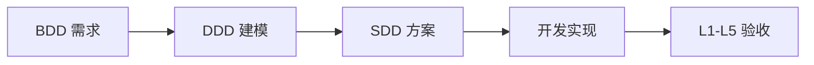

# Agileflow — AI Agent Skill · 1 小时快速交付

[English](README.md) | **中文**

> 用敏捷五阶段 + **BDD→DDD→SDD→TDD**，把「想法」变成「可运行、可验收、可交接」的成品。简单项目 **~1 小时上线**，MVP **当天可交付**。

[](skills/agileflow/SKILL.md)
[](#为什么能-1-小时上线)

---

## 一句话介绍

**Agileflow** 把软件工程最佳实践写成 AI 可执行的 Skill：**BDD** 写需求、**DDD** 建模型、**SDD** 定方案、**TDD** 写代码，每阶段有人类确认闸门，全程产出 `atlas/` 文档。  
对 AI 说「走 agileflow」—— 从 0 到可部署，**最快 1 小时，通常半天内完成 MVP**。

> **快速模式 ≠ 跳阶段。** 仍按 req→mod→sol→dev→tests；只少问、可推并发。**dev 文档唯一完整质量线**，不因快速而减厚。

---

## 为什么能 1 小时上线？

传统 AI 编程：**想到哪写到哪** → 缺测试、缺文档、改需求全推翻，上线周期以「天」计。

Agileflow 的做法：**流程压缩，但不牺牲结构**。

| 环节 | 传统做法 | Agileflow 快速模式 | 典型耗时 |
|------|----------|-------------------|----------|
| 需求 | 口头描述，AI 猜 | BDD 场景 + 1 轮确认 | **5–10 min** |
| 建模 | 跳过或事后补 | 轻量 DDD：核心表 + DDL | **5–10 min** |
| 方案 | 边写边改 | SDD 模板：API + 任务清单 | **10–15 min** |
| 开发 | 大段生成、难维护 | 按原子任务逐块实现 | **20–30 min** |
| 验收 | 手动点一点 | L1+L3 自动跑通 | **5–10 min** |
| **合计** | 1–3 天 + 返工 | **~1 小时**（简单 CRUD / 工具类） | |

> **更快**（**须未启用 AF**）：hotfix、微型改动 → 豁免全流程，**L1+L3 几分钟**。  
> **已启用 AF**：任何写码须 `--gate write-code` 绿，无微型/hotfix 捷径。

---

## 解决谁的痛点？

| 人群 | 常见痛点 | Agileflow 怎么帮 |
|------|----------|------------------|
| **独立开发者 / 创业者** | 有想法但 weeks 才出 Demo | 快速模式：**~1 小时**出可部署 Demo |
| **接外包 / 副业开发者** | 交付无文档难收尾 | atlas/ 全套 + REQ ↔ 验收报告一一对应 |
| **小团队 Tech Lead** | AI 产出难 Review、难交接 | 五阶段产出可分工、可审计 |
| **后端 / 全栈工程师** | 表结构和 API 对不上 | DDD 前置，DDL 和 API 先确认再写码 |
| **怕 AI 跑偏的用户** | AI 闷头写，方向错了全推翻 | **阶段闸门 + 需求确认卡片**，每步等你点头 |
| **AI 干一半就卡死的用户** | 缺密钥、缺环境，AI 假装完成 | **humanTodo** 明确列出需要你帮忙的事，未齐则 `BLOCKED-HUMAN` |
| **不知道 AI 在干嘛的用户** | 对话关了进度全丢 | **`atlas/todo.md` 实时进度** + 断点续跑「继续 agileflow」 |
| **需要合规的团队** | 需求→实现→测试无法追溯 | BDD 场景 → 测试 → 独立验收报告，全程留痕 |

---

## 核心亮点

### 🚀 1 小时快速交付

不是「AI 乱写一堆代码」，而是**压缩流程、保留结构** —— 简单 CRUD / 工具类项目，五阶段跑完 **~1 小时**可部署；MVP **当天交付**。

| 模式 | 速度 | 适用 |
|------|------|------|
| **快速模式** | ~1 小时 | Demo、CRUD、内部工具 |
| **严谨模式** | 半天–1 天 | 支付/权限/核心业务 |
| **豁免通道** | 几分钟 | 改一行 bug、hotfix（L1+L3） |

---

### 📐 敏捷五阶段 × BDD→DDD→SDD→TDD

每一阶段绑定一种工程方法论，**先想清楚再写代码**，不是 AI 想到哪写到哪：

```
需求澄清 → 数据建模 → 技术方案 → 开发实现 → 测试验收
   BDD        DDD         SDD         TDD      L1–L5
  ~10min     ~10min      ~15min      ~30min    ~10min
```

| 阶段 | 方法论 | 核心产出 |
|:----:|:------:|----------|
| 1 需求澄清 | **BDD** | `REQ-*.md`（Given-When-Then 验收场景） |
| 2 数据建模 | **DDD** | 聚合根、不变量、ER 图、`sql/init.sql` |
| 3 技术方案 | **SDD** | 架构、API 契约、可观测性、原子任务拆解 |
| 4 开发实现 | **TDD** | 业务代码 + 测试（严谨模式：红→绿→重构） |
| 5 测试验收 | **BDD 回溯** | 逐 REQ 验收报告 + L1–L5 流水线 |

---

### 🤝 人类在环 — AI 干不了的，明确找你要

AI 不是闷头干到底，**关键决策和外部资源必须人类参与**：

| 机制 | 什么时候触发 | 你需要做什么 |
|------|-------------|-------------|
| **需求确认卡片** | 阶段 1：信息不足 / 草稿完成 | 选功能范围、确认 BDD 场景对不对 |
| **领域规则确认** | 阶段 2：建模草稿完成 | 确认聚合根、不变量、表结构 |
| **阶段闸门** | 阶段 1–4 每阶段结束 | 点「是，继续」才进入下一阶段；点「否，暂停」随时停 |
| **humanTodo 人类待办** | 任何阶段识别到外部依赖 | 提供 API 密钥、商户号、`.env`、业务拍板、运维资源等 |

**humanTodo 示例**（AI 自动写入 `atlas/humanTodo.md`）：

| 事项 | 来源 | 状态 |
|------|------|------|
| 提供微信支付商户号及 API 密钥 | 需求澄清 | ⬜ 待办 |
| 确认 `.env.local` 数据库连接已配置 | 技术方案 | ⬜ 待办 |
| 业务方确认订单状态流转规则 | 数据建模 | ✅ 已完成 |

- AI 遇到 ⬜ 待办 → **主动暂停**，不会假装完成
- 你完成后通知 AI → 解除阻塞，继续流程
- 资源未齐时验收结论为 **`BLOCKED-HUMAN`**，不会误标「交付完成」

**你掌控方向，AI 负责执行 —— 不是 AI 替你做决定。**

---

### 📊 进度全程可见 — 随时知道 AI 卡在哪

打开 `atlas/` 文件夹，**一眼看清项目走到哪、还剩什么**：

**① 阶段声明行** — 每次 AI 回复首行告诉你当前状态：

```
📍 Agileflow | 模式：快速 | 阶段：3-技术方案 | 依据：todo 下一未完成阶段
```

**② `atlas/todo.md`** — AI 任务 + 流程进度 + 变更历史：

```markdown
## 流程进度
- [x] 需求澄清 ✅
- [x] 数据建模 ✅
- [ ] 技术方案 🔄        ← 当前阶段
- [ ] 开发实现
- [ ] 测试验收

## 开发任务
- [x] 创建数据库表
- [ ] 实现用户 API 🔄    ← 正在做
- [ ] 实现订单 API

## 变更历史
| 时间 | 操作 | 说明 |
| 2026-06-11 10:30 | 完成 | REQ-001 需求已确认 |
| 2026-06-11 10:45 | 进行中 | 数据建模草稿待确认 |
```

**③ REQ 状态流转** — 每个需求文档有明确生命周期：

```
草稿 → 已确认 → 已实现 → （已废弃）
```

**④ 断点续跑** — 关掉对话再回来，说「继续 agileflow」，AI 读 `todo.md` 从断点接着干，**不用重复解释**。

**⑤ 验收报告** — 阶段 5 每个 REQ 一份报告，场景逐条 ✅ / ❌，结论 PASS / BLOCKED-HUMAN / FAIL。

---

### 🛡️ 质量有保障 — L1–L5 分层验收

| 层 | 验什么 | 快速模式 | 严谨模式 |
|----|--------|:--------:|:--------:|
| L1 | Lint / Type Check | ✅ | ✅ |
| L2 | Build 编译 | ✅ | ✅ |
| L3 | 单元 / 集成测试（含 REQ 用例） | ✅ | ✅ |
| L4 | 覆盖率 ≥80% | — | ✅ |
| L5 | 冒烟 / E2E（真连外部资源） | 可 skip | ✅ |

测试失败 AI 自动重跑最多 3 轮；仍失败 → 回阶段 4 修复，**不会带着 bug 标 PASS**。

---

### 📁 atlas/ 文档体系 — 快交付也能交接

全程自动生成，**可 Review、可分工、可审计**：

```
atlas/
├── requirements/REQ-001-xxx.md   # BDD + 可选 ui/UID-*
├── model/                        # DDD（快速可用 model-overview）
├── solution/architecture.md      # SDD + features/contracts
├── dev/T-xxx-*.md                # 每任务①构思
├── tests/REQ-*-验收报告.md        # 逐 REQ 验收
├── todo.md                       # 进度 + ①②③
└── humanTodo.md                  # 需要你帮忙的事
```

---

### 🧭 智能路由 — 小事不走全流程

| 场景 | 走什么 |
|------|--------|
| 改一行 bug、纯答疑、hotfix | 豁免五阶段，L1+L3 **几分钟**（**须未启用 AF**：无 `atlas/agileflow.env` / `requirements/`） |
| API / DB / 权限 / 多模块变更 | 强制完整五阶段 |
| 用户说「快速通道 / 不走流程」 | 仅未启用 AF 时可微型豁免；已启用 AF → `--gate write-code` 硬挡 |

AI 不会把「解释这行代码」也拉进五阶段，**该快则快，该重则重**。

---

## 安装

```bash
git clone https://github.com/aiKeeo/AgileFlow.git
```

将 `skills/agileflow` 复制到你使用的 Skill 目录：

| 工具 | 项目内 | 全局 |
|------|--------|------|
| **Cursor** | `YOUR_PROJECT/.cursor/skills/agileflow` | `~/.cursor/skills/agileflow` |
| **Claude Code** | `YOUR_PROJECT/.claude/skills/agileflow` | `~/.claude/skills/agileflow` |
| **Trae** | `YOUR_PROJECT/.trae/skills/agileflow` | `~/.trae/skills/agileflow` |

```bash
# 示例（Cursor）
cp -r AgileFlow/skills/agileflow YOUR_PROJECT/.cursor/skills/

# 示例（Claude Code）
cp -r AgileFlow/skills/agileflow YOUR_PROJECT/.claude/skills/

# 示例（Trae）
cp -r AgileFlow/skills/agileflow YOUR_PROJECT/.trae/skills/
```

项目地址：[github.com/aiKeeo/AgileFlow](https://github.com/aiKeeo/AgileFlow)

---

## 使用

```
走 agileflow，我想做一个待办清单 API，今天就要上线
```

```
继续 agileflow                    # 从 atlas/todo.md 断点续跑
走完整流程，快速模式，1 小时内交付
```

指定阶段：`写需求` / `做数据建模` / `出技术方案` / `按方案开发` / `跑验收测试`

AI 首行声明示例：

```
📍 Agileflow | 模式：快速 | 阶段：1-需求澄清 | 依据：新功能，目标 1h 交付
```

---

## 1 小时交付示例

**场景**：记账 API（CRUD + SQLite）

| 时间 | 阶段 | AI 产出 |
|------|------|---------|
| 0:05 | 需求澄清 | REQ-001.md |
| 0:10 | 数据建模 | `atlas/model/` + DDL |
| 0:20 | 技术方案 | `architecture.md` + 详细 todo |
| 0:50 | 开发实现 | 业务代码 + L3（完整质量线写①） |
| 1:00 | 测试验收 | L1+L3 PASS，验收报告 |

**结果**：可运行代码 + atlas/ 文档 + 验收报告，直接部署或演示。

---

## 流程示意



---

## 目录结构

```
AgileFlow/
├── README.md
├── README.zh-CN.md
├── LICENSE
└── skills/agileflow/
    ├── SKILL.md
    ├── phases/          # 五阶段指令
    ├── templates/       # 文档 & 闸门模板
    └── examples/
```

---

## 适用 / 不适用

| ✅ 适合 | ❌ 不必 |
|--------|--------|
| 走 agileflow / 完整流程 / 今天上线 | 纯解释、答疑 |
| 从零做系统、MVP、Demo | Code Review、读代码 |
| 已有 atlas/ 说「继续 agileflow」 | 单文件小改、改一行 bug |

---

## 版本

**v9.18.3** — 详见 [SKILL.md](skills/agileflow/SKILL.md)

---

## License

MIT

---

## 贡献

欢迎 Issue / PR。
