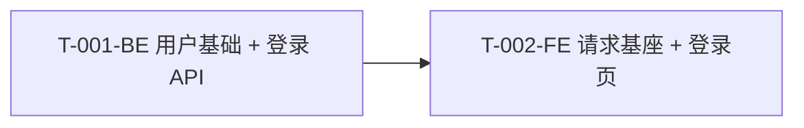

# 架构

## 技术栈

| 层 | 选型 |
|----|------|
| 前端 | 微信小程序原生 |
| 后端 | NestJS + TypeORM + MySQL |
| 鉴权 | JWT + BCrypt |

## 项目初始状态

- 本示例为 **greenfield**：`backend/src` 和 `miniprogram/` 初始为空。
- 没有现成 User 模块、没有现成请求基座、没有现成登录页面。
- T-001 负责先建用户基础，T-002 负责先建前端请求基座。

## 资源清单（本示例要新建）

| 资源 | 由谁创建 | 说明 |
|------|----------|------|
| `backend/src/user/user.entity.ts` | T-001 | 用户表：phone, password_hash, nickname, created_at |
| `backend/src/user/user.repository.ts` | T-001 | 按 phone 查询用户 |
| `backend/src/user/user.service.ts` | T-001 | `findByPhone` / `create` 等基础方法 |
| `backend/src/auth/auth.controller.ts` | T-001 | `POST /api/auth/login` |
| `backend/src/auth/auth.service.ts` | T-001 | JWT 签发 + 密码校验 |
| `backend/src/auth/dto/login.dto.ts` | T-001 | 登录请求入参校验 |
| `backend/src/auth/auth.module.ts` | T-001 | 注册 Controller / Service / JwtService |
| `miniprogram/services/api.ts` | T-002 | 请求基座：baseURL、token 注入、统一错误处理 |
| `miniprogram/services/auth.ts` | T-002 | `authService.login` 封装 |
| `miniprogram/pages/login/index.*` | T-002 | 页面三件套 + 表单逻辑 |

## 模块

| 路径 | 职责 | 对应 T | 状态 |
|------|------|--------|------|
| `src/user` | 用户实体、Repository、基础 Service | T-001 | 本示例新建 |
| `src/auth` | 登录、JWT 签发 | T-001 | 本示例新建 |
| `miniprogram/services` | 请求基座与接口封装 | T-002 | 本示例新建 |
| `miniprogram/pages/login` | 登录页 | T-002 | 本示例新建 |

## 依赖关系

T-001-BE 完成后，T-002-FE 才能联调。



## 本地验证

```bash
# BE
cd backend
npm install
npm run build && npm run start:dev

# FE
cd miniprogram
npm install
npm run build:weapp
```
