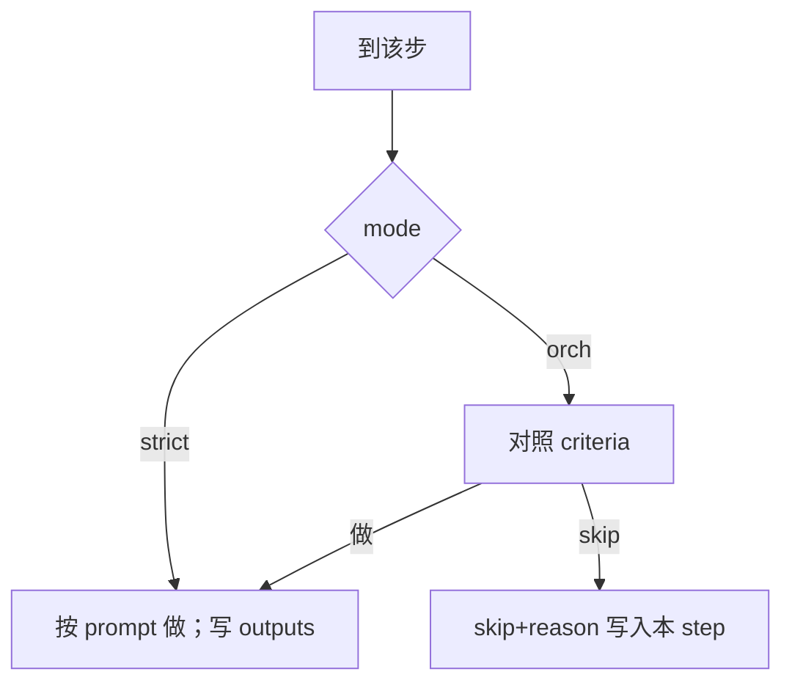

# flow.yaml — 流程编排

> **运行时**：`{项目根}/atlas/flow.yaml`  
> **本文**：约定；默认正文见下方模板（**路径写在模板每一步里**）。  
> 目录铁律 → [`atlas-structure.md`](../phases/atlas-structure.md)  
> 派活 → `resolveRolePrompt(projectRoot, prompt)`（`prompt` = RoleKey）  
> 光标 → `atlas/agileflow.env` 的 **`AF_STEP`**（单步 id，或并行波 `id1,id2`；`AF_PHASE`=最左档）

---

## 铁律：steps = 默认链（可按依赖并行）

`steps` **自上而下是完整轨要走的格子**。到步 → **执行**，不是到步再问「要不要做」。

- **书写序**：阅读序、同波排序、`AF_PHASE` 取最左步。  
- **能否开干 / 能否并行**：只看各步 **`depends` / `outputs`**。前置已齐且互不依赖对方产物 → **同一波并行**（如调研 ∥ 竞品）。  
- **门牌 = `id`**：用户打 `research:` → 总控读 flow 命中该 id → 启动**含该步的就绪波** → 做完往下。不加单独 tag 字段。  
- **保留字**不可作 id：`fix` / `revise` / `explore` / `ut` 等快捷前缀。

**唯一允许不执行的情况：**

| 条件 | 谁决定 | 怎么落盘 |
|------|--------|----------|
| **`mode: orch`** 且对照 **`criteria` 判定可跳** | AI（总控）决策 | 写 `skip: true` + `reason` 后再进下一步/下一波 |
| **用户明确要求跳过该步**（含关严格步） | 用户 | 写 `skip` + `reason`（须能看出是用户要求） |

除此之外：**禁止静默跳、禁止为赶工跳、禁止把「好像不需要」当成 skip。**  
`mode: strict` → 到步必做；没有用户明示，AI **无权** skip。

### 与阶段 4「T 并行」划界

| 层 | 并行谁 | 依据 |
|----|--------|------|
| **Flow 波** | `flow.yaml` 的 steps | step.`depends`/`outputs` |
| **Dev 批** | todo 里多个 T | T.`depends_on` + 路径不撞 | 仅当前波含 `dev` 时

---

## 默认模板（复制为 `atlas/flow.yaml`）

```yaml
version: 1
steps:
  - id: req
    mode: strict
    prompt: req
    # 上游依赖（派活前总控保证可读；无则按阶段文档处理）
    depends:
      - atlas/agileflow.env
      - atlas/glossary.md
    # 本步产物（角色/总控只写这些约定路径）
    outputs:
      - atlas/requirements/REQ-*.md
      - atlas/requirements/README.md
      - atlas/requirements/ui/UID-*.md          # 按需
      - atlas/requirements/ui/prototypes/      # 按需

  - id: model
    mode: orch
    prompt: model
    criteria:
      - "无新业务实体、无状态机、无跨表不变式 → 可判定 skip"
      - "仅字段级微调且已有 model 覆盖 → 可判定 skip 或增量"
      - "新实体 / 状态机 / 权限主体变化 → 必须执行（禁止 skip）"
      - "拿不准 → 按执行，禁止为赶工 skip"
    depends:
      - atlas/requirements/REQ-*.md            # 须已确认
    outputs:
      - atlas/model/README.md
      - atlas/model/conceptual/entity-relations.md
      - atlas/model/conceptual/domain-rules.md
      - atlas/model/entities/*.md
      - atlas/model/physical/schema.md        # 无持久化则 N/A

  - id: sol
    mode: strict
    prompt: sol
    depends:
      - atlas/requirements/REQ-*.md
      - atlas/model/                          # 若上步未 skip
    outputs:
      - atlas/solution/README.md
      - atlas/solution/features/F-*.md
      - atlas/solution/contracts/             # 按需 API-*/UI-*
      - atlas/solution/architecture.md
      - atlas/solution/code-patterns-*.md     # 按需
      - atlas/todo.md                        # T 头只写根 todo

  - id: dev
    mode: strict
    prompt: dev
    depends:
      - atlas/todo.md
      - atlas/solution/features/F-*.md
      - atlas/requirements/REQ-*.md
      - atlas/solution/contracts/             # 按需
    outputs:
      - atlas/dev/T-*-*.md                   # 每任务构思
      # 业务源码在工程目录（src/ 等），不进 atlas

  - id: test
    mode: strict
    prompt: null                            # 总控直做 phases/05-testing.md
    depends:
      - atlas/todo.md
      - atlas/dev/T-*-*.md
      - atlas/requirements/REQ-*.md
      - atlas/tests/                          # 入场延续
    outputs:
      - atlas/tests/REQ-*-验收报告.md
      - atlas/tests/README.md
      - atlas/tests/fe-pixel/                 # 按需
      - atlas/logs/fe-smoke-report.json       # 有 FE 时
      - atlas/logs/fe-smoke-shots/
      - atlas/logs/fe-smoke-visual-review.md
```

**插入步**（夹在中间时）——路径也写在该步上：

```yaml
  - id: research
    mode: strict
    prompt: null
    depends: []
    outputs:
      - atlas/logs/research-login.md
    reason: "夹在 req 前：先调研"
```

**总控 skip model 时**在该 step 上追加（不要另造 `by`）：

```yaml
  - id: model
    mode: orch
    prompt: model
    criteria: [ …同上… ]
    depends: [ … ]
    outputs: [ … ]
    skip: true
    reason: |
      对照 criteria：无新实体…
    check:
      - "…"
      - "…"
      - "…"
      - "…"
```

**用户关严格步**同样只加 `skip` + `reason`（须能看出是用户要求；写进 reason 原文即可）。

---

## 派活怎么用本文件（是的，就是这样）

总控到某步时：

1. 读该步 `mode` / `criteria`（orch 先判定；strict 直接做）。  
2. **`prompt`** → `resolveRolePrompt` 得到角色提示词正文（或 `null` 总控自己读 `phases/*.md`）。  
3. **`depends`** → 填进任务信封的 **上游路径**（`upstreamPaths`）：**只列路径，不粘贴正文**。  
4. **`outputs`** → 填进信封的 **产物期望**（`expectedOutputs`）。  
5. 完整 Subagent 输入 = **角色提示词 + 薄信封**（现网 `formatDispatchPrompt`）。

Subagent 侧：

- 先按提示词（`atlas/role/role-*.md` 或 layers 拼装）行事；  
- 再用 Read **自己去读** `depends` 里的文件；  
- **只写** `outputs` 约定路径（写错目录闸门红）。

总控 **不** 把 REQ/方案全文塞进派活 prompt；路径来自本步的 `depends`/`outputs`。

---

## 总控到步（AF_STEP + skip）

1. **光标**：`atlas/agileflow.env` 的 **`AF_STEP`** = 当前 `flow.yaml` 里某步 `id`（**含自定义步**如 `research`）。  
2. **到步默认执行**：读该步 `mode` / `prompt` / `depends` / `outputs` 并加载（派活或总控直做）。  
3. **`orch`**：对照 `criteria`；可跳 → 写 `skip`+`reason`；**然后 `AF_STEP` +1**（`nextEnabledStep`）。  
4. **`strict`**：做完或用户明示 skip 后 **`AF_STEP` +1**。  
5. **同步**：`AF_PHASE` = `bandForStep(flow, AF_STEP)`（闸门档 0–5；自定义步映射**左侧最近内置步**）。改 `AF_STEP` 必须同步 `AF_PHASE`。  
6. **`depends` / `outputs`** 不因跳步改写；缺文件由阶段/角色处理。  
7. **`init` 不在 steps**：brownfield 进场初始化单独做完再进主链。

### `AF_STEP` 与 `AF_PHASE`

| 字段 | 说明 |
|------|------|
| **`AF_STEP`** | **唯一进度光标** = `steps[].id` |
| **`AF_PHASE`** | **派生闸门档** 0–5；内置步用自身编号；自定义步用左侧最近内置档 |
| **+1** | 完成或合法 skip 后写入下一步 `id`（跳过已 `skip: true` 的步） |
| **脚本** | `bandForStep` / `nextEnabledStep` / `stepToDispatchEnvelope` / **`advanceStep`**（成对写 STEP+PHASE） |

### 内置 id → 闸门 / PHASE（不写进 yaml）

| id | `AF_PHASE` | 默认 gate |
|----|------------|-----------|
| init | 0 | `init-confirm` |
| req | 1 | `req-confirm` |
| model | 2 | `mod-confirm` |
| sol | 3 | `sol-confirm` |
| dev | 4 | `write-code`（②前）等 |
| test | 5 | `test-entry` |

---

## 脚本如何感知 flow（硬约束）

| 行为 | 实现 |
|------|------|
| 形状校验 | `validateFlowFile`（`FLOW-*`）；有 `agileflow.env` 缺 flow → **warn**（过渡）；有文件则形状 **error** |
| model skip | `isModelingSkipped` **优先**读 `flow.yaml`；dir / doc-first / write-code 全链跟跳 |
| 闸门短路 | `req-confirm` / `mod-confirm` / `sol-confirm` / `test-entry`：若对应步 `skip` → **`FLOW-STEP-SKIP` info，gate 视为 PASS** |
| write-code | 读 flow：`req`/`sol`/`model`/`dev` skip 则**不**再硬要对应产物；未 skip 的上游仍须就绪 |
| 不因 depends glob 硬检存在性 | 按需路径（UID/glossary/fe-smoke）不因列在 yaml 就 FAIL |

**fallback**：无 `atlas/flow.yaml` 时行为≈旧项目（model 仍可 todo 正式跳过行）；新项目以 bootstrap 写入默认为准。

### scaffold

`--bootstrap-scaffold` **同时写入**默认 `atlas/flow.yaml`（复制 `templates/flow.yaml`）。已存在则不覆盖。

---

## 字段（只这些）

| 字段 | 含义 |
|------|------|
| `version` | 格式版，现 `1` |
| `steps` | 有序步骤 |
| `id` | 步名；内置 `init\|req\|model\|sol\|dev\|test`，其它=插入 |
| `mode` | `strict`=到步必做，总控不可 skip；`orch`=须有 `criteria`，总控可判定 skip |
| `prompt` | `req\|model\|sol\|dev` → `resolveRolePrompt`；`null` → 总控读对应 `phases/*.md`；插入也可 `null` 或已有 `atlas/role/某.md` 路径 |
| `criteria` | **仅 `orch`**：判定标准（事先） |
| `depends` | **依赖路径**（派活/开干前应具备的上游） |
| `outputs` | **产物路径**（本步允许/应写的落盘位置；glob 用 `*`） |
| `skip` | `true`=本步不做；对应 gate SKIP；不得假完成宣称 |
| `reason` | 为何 skip / 为何插入 |
| `check` | 可选；model skip 时本次自检 |

### 不要的字段

`by`、`cursor`、`gate`、`kind`、`progress`、`artifact`（并入 `outputs`）、`track`、`meta`、`history`、`judgements` 大块。

---

## `prompt` 落到哪（现网）

| `prompt` | 读哪里 |
|----------|--------|
| `req`/`model`/`sol`/`dev` | custom：`atlas/role/role-{key}.md`；默认：`skills/agileflow/templates/role/layers/{key}/`（`resolveRolePrompt`） |
| `null` | 总控：`phases/01-requirement.md` 等（按 `id`）；test→`05-testing.md`；init→`00-project-init.md` |
| 插入自定义文件 | 路径须已存在，如 `atlas/role/role-research.md` |

角色 stamp 来源：`--bootstrap-scaffold` 把 `templates/role/role-*.md` → `atlas/role/`。

---

## 模式（短）



---

## 校验（形状 + 与闸门联动）

- 每步有 `id`/`mode`/`prompt`/`depends`/`outputs`。  
- `orch` ⇒ 非空 `criteria`。  
- `skip: true` ⇒ 非空 `reason`；`strict` 的 skip 须能看出用户意图。  
- 路径铁律：禁止 `atlas/req/`、`atlas/sol/`、`atlas/solution/todo.md`。  
- **闸门**：见上文「脚本如何感知 flow」——skip 步对应 gate **SKIP/PASS**，不验该步 outputs 必存在。

---

## 已澄清（对照审查）

| 点 | 结论 |
|----|------|
| PHASE vs 插入 | PHASE 仍 0–5；插入不占号，停在左侧内置 PHASE |
| 脚本感知 | 已读 flow：skip 短路闸门 + doc-first/write-code 跟跳 |
| write-code | 只硬要**未 skip** 的上游 |
| scaffold | bootstrap **写**默认 flow.yaml |
| 优先级 | flow 管做不做；phases 管怎么做（SKILL 链已写） |
| majorflow | 人读产品说明；skill 内有副本，非运行时必读 |
| test id | step id = `test`；目录仍 `atlas/tests/` |
| depends | 文件路径，不因跳步改写；缺文件角色/阶段文档处理 |
| 新阶段 / 改编排 | **不是** revise 禁区说「不行」——默认改 `flow.yaml` 并从该步**重新走**完整轨 → [quick-commands §新阶段](../phases/quick-commands.md) |

按需 glob **不**做存在性硬检。
